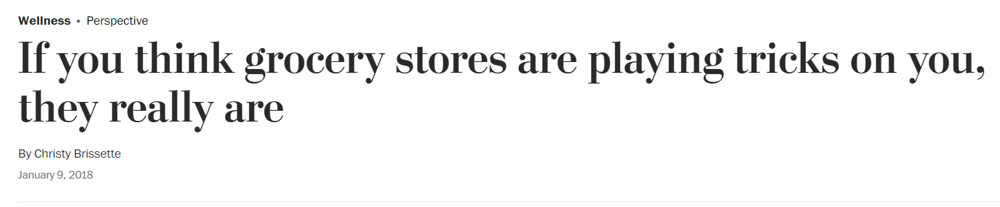

# How does US buy groceries? 

Almost all of human behavior is predictable. This psychological phenomenon is exploited by physical grocery to the best extent possible.  

## Motivation
There is an interesting article about this published by the Washington Post which you can read [here](https://www.washingtonpost.com/lifestyle/wellness/if-you-think-grocery-stores-are-playing-tricks-on-you-they-really-are/2018/01/05/4c49450a-deb2-11e7-8679-a9728984779c_story.html).  

## Objective

* I wanted to learn more about the obvious, things that'll make you go, "Oh yeah, of course, that makes sense!"
* I also wanted to find things that might make you go, "Are you serious? That can't be right". These findings lead us to some questions, that can aid in the future decision making process for any business.

## Key Findings

* Buying trends change rapidly and exhibit seasonality across the day and week
* There is a strong trend in when certain foods are bought (such as healthy foods) - *very few people are in the mood of eating healthy later in the day, appaently*
* There are some odd outliers in items that aren’t be reordered very often - *do Instacart customers just not like to stick to their favorite brand of shampoo?*
* A small chunk of users drive a large chunk of business - *we see the Pareto rule in action*

## Video Walkthrough
https://user-images.githubusercontent.com/85018020/160469993-0384bd2a-7a10-4883-b336-505dc9da44e5.mp4

## Presentation
[View Presentation as PDF](https://github.com/namanarora97/Instacart-Deep-Dive/files/8365595/findings.pdf)

*Made with ❤ and 🦙 by [Akshay](https://github.com/akshaybahadur21) and [Naman](https://github.com/namanarora97)*

